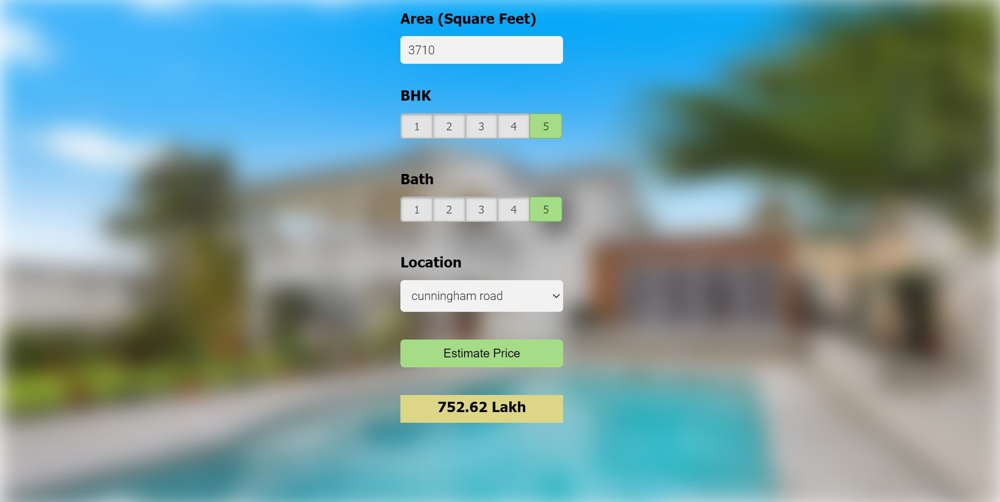

# Home-Price-Prediction

In this project I have built a real estate price prediction website. First I built a model by applying sklearn and linear regression using banglore home prices dataset from kaggle.com . Then wrote a python flask server that uses the saved model to serve http requests. Third component is the website built in html, css and javascript that allows user to enter home square ft area, bedrooms, bathrooms and location, finally it calls python flask server to retrieve the predicted price.

Technology and tools used in this project include:

1. Python
2. Numpy and Pandas for data cleaning
3. Matplotlib for data visualization
4. Sklearn for model building
5. Google Colaboratory and Visual Studio Code as IDE
6. Python flask for http server
7. HTML/CSS/Javascript for UI
